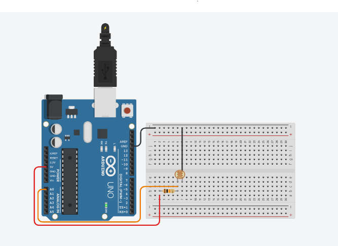

# Medindo a luminosidade
Neste experimento é feita a leitura de um fotoresistor e armazenado em uma variável, depois esta variável será impressa no monitor serial. O fotoresistor será conectado à porta analógica 0.  

 <b><a href="https://www.tinkercad.com/things/80tBYiyemrX">Clique Aqui</a></b> para ver o projeto em Tinkercard.com!
 
## Lista de componentes:

- 1  Arduíno UNO R3
- 1  Um cabo de conexão USB
- 1  Placa de prototipação (Protoboard)
- 1  Resistor de 10k Ω ohms
- 1  Fotoresistor (Sensor de luminosidade) LDR
- 4  Jumpers (macho-macho)

## Esquema do projeto

